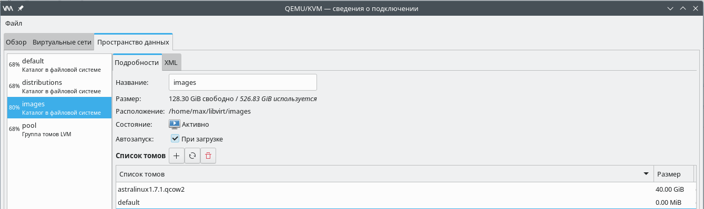
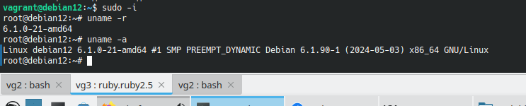
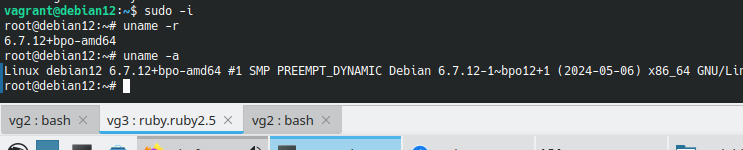

### Создание Vagrant-образа виртуальной машины, работающей под управлением Debian Linux 12 - Bookworm.
### Обновление ядра операционной системы.
Используется гипервизор Qemu-KVM, библиотека Libvirt. В качестве хостовой системы - OpenSuse Leap 15.5.
Для работы Vagrant с Libvirt установлен пакет vagrant-libvirt:
```
Сведения — пакет vagrant-libvirt:
---------------------------------
Репозиторий            : Основной репозиторий
Имя                    : vagrant-libvirt
Версия                 : 0.10.2-bp155.1.19
Архитектура            : x86_64
Поставщик              : openSUSE
Размер после установки : 658,3 KiB
Установлено            : Да
Состояние              : актуален
Пакет с исходным кодом : vagrant-libvirt-0.10.2-bp155.1.19.src
Адрес источника        : https://github.com/vagrant-libvirt/vagrant-libvirt
Заключение             : Провайдер Vagrant для libvirt
Описание               : 

    This is a Vagrant plugin that adds a Libvirt provider to Vagrant, allowing
    Vagrant to control and provision machines via the Libvirt toolkit.
```
Образ операционной системы создём заранее, для этого установим [Debian Linux из официального образа netinst](https://www.debian.org/distrib/netinst)
При установке заведём нового пользователя с именем vagrant. 
Если при установке операционной системы не был создан пользователь vagrant, то создадим его с помощью команды:
```
useradd -m -s /bin/bash -G sudo vagrant
```
 Где:
```
-m - создать домашний каталог;
-s /bin/bash - задать командную оболочку;
-G sudo - включить пользователя в группу sudo, что позволит ему выполнять команды с sudo;
```
После установки и запуска операционной системы, залогинимся под учетной записью пользователя vagrant 
(предварительно, во время установки ОС отметим пункт SSH-сервер) и загрузим и зарегистрируем 
стандартный ключ ssh vagrant для доступа без пароля: 
```
vagrant@debian12:~$ wget https://raw.githubusercontent.com/hashicorp/vagrant/master/keys/vagrant.pub
vagrant@debian12:~$ ssh-copy-id -f -i vagrant.pub vagrant@localhost
```
Ранее мы создали каталог в файловой системе, который будет использоваться как хранилище образов виртуальных машин: 

В этом хранилище уже находится образ диска новой виртуальной машины. Подготовим сценарий конвертации образов виртуальных машин qcow2 в контейнеры vagrant. 
Оригинал сценария доступен по [ссылке](https://raw.githubusercontent.com/vagrant-libvirt/vagrant-libvirt/master/tools/create_box.sh)
оригинальное описание применения сценария доступно по [ссылке](https://github.com/vagrant-libvirt/vagrant-libvirt)

Необходимо сохранить сценарий в файле именем create-box.sh в рабочем каталоге и сделать исполняемым:
```
chmod u+x create-box.sh
```
Каталог для хранения образов вируальных машин по умолчанию в libvirt - /var/lib/libvirt/images/. 
Как правило в каталоге var, смонтированном обычно в корневой раздел, недостаточно места для разворачивания крупных образов.
Поэтому ранее мы создали новое хранилище - images:

Изменим в скрипте create-box.sh строку:
```
libvirt.storage_pool_name = "default"
```
на 
```
libvirt.storage_pool_name = "images"
```
Выполним конвертацию образа виртуальной машины в контейнер vagrant с помощью сценария: 
```
./create-box.sh /home/max/libvirt/images/debian12.qcow2 /home/max/vagrant/images/debian12 vagrantfile.info
```
Где содержимое файла vagrantfile.info: 
```
config.vm.guest = "debian";
config.nfs.verify_installed = false;
config.vm.synced_folder ".", "/vagrant", disabled: true
```
 Здесь:
```
config.vm.guest = «debian» - тип виртуальной машины;
config.nfs.verify_installed = false; - запрет проверки наличия клиента монтирования NFS (включить, если монтирование не используется);
config.vm.synced_folder «.», «/vagrant», disabled: true - если не требуется копирование текущего каталога в каталог /vagrant виртуальной машины, то запретить его
```
Доступные типы виртуальных машин можно найти в каталоге расширений для Vagrant. Чтобы узнать, где пакет vagrant-libvirt хранит расширения, выполним команду:
```
localhost:~ # rpm -ql vagrant | egrep 'plugins/guests$'
/usr/share/vagrant/gems/gems/vagrant-2.2.18/plugins/guests
```
Проверим содержимое каталога:
```
max@localhost:~/vagrant/vg3> ls -l /usr/share/vagrant/gems/gems/vagrant-2.2.18/plugins/guests
итого 160
drwxr-xr-x 3 root root 4096 апр 16 12:11 alpine
drwxr-xr-x 3 root root 4096 апр 16 12:11 alt
drwxr-xr-x 3 root root 4096 апр 16 12:11 amazon
drwxr-xr-x 3 root root 4096 апр 16 12:11 arch
drwxr-xr-x 3 root root 4096 мая 13  2020 astra
drwxr-xr-x 3 root root 4096 апр 16 12:11 atomic
drwxr-xr-x 3 root root 4096 апр 16 12:11 bsd
drwxr-xr-x 3 root root 4096 апр 16 12:11 centos
drwxr-xr-x 3 root root 4096 апр 16 12:11 coreos
drwxr-xr-x 3 root root 4096 апр 16 12:11 darwin
drwxr-xr-x 3 root root 4096 апр 16 12:11 debian
drwxr-xr-x 2 root root 4096 апр 16 12:11 dragonflybsd
drwxr-xr-x 2 root root 4096 апр 16 12:11 elementary
drwxr-xr-x 3 root root 4096 апр 16 12:11 esxi
drwxr-xr-x 3 root root 4096 апр 16 12:11 fedora
drwxr-xr-x 3 root root 4096 апр 16 12:11 freebsd
drwxr-xr-x 3 root root 4096 апр 16 12:11 funtoo
drwxr-xr-x 3 root root 4096 апр 16 12:11 gentoo
drwxr-xr-x 3 root root 4096 апр 16 12:11 haiku
drwxr-xr-x 2 root root 4096 апр 16 12:11 kali
drwxr-xr-x 3 root root 4096 апр 16 12:11 linux
drwxr-xr-x 2 root root 4096 апр 16 12:11 mint
drwxr-xr-x 3 root root 4096 апр 16 12:11 netbsd
drwxr-xr-x 3 root root 4096 апр 16 12:11 nixos
drwxr-xr-x 3 root root 4096 апр 16 12:11 omnios
drwxr-xr-x 3 root root 4096 апр 16 12:11 openbsd
drwxr-xr-x 3 root root 4096 апр 16 12:11 openwrt
drwxr-xr-x 3 root root 4096 апр 16 12:11 photon
drwxr-xr-x 3 root root 4096 апр 16 12:11 pld
drwxr-xr-x 3 root root 4096 апр 16 12:11 redhat
drwxr-xr-x 3 root root 4096 апр 16 12:11 rocky
drwxr-xr-x 3 root root 4096 апр 16 12:11 slackware
drwxr-xr-x 3 root root 4096 апр 16 12:11 smartos
drwxr-xr-x 3 root root 4096 апр 16 12:11 solaris
drwxr-xr-x 3 root root 4096 апр 16 12:11 solaris11
drwxr-xr-x 3 root root 4096 апр 16 12:11 suse
drwxr-xr-x 3 root root 4096 апр 16 12:11 tinycore
drwxr-xr-x 2 root root 4096 апр 16 12:11 trisquel
drwxr-xr-x 2 root root 4096 апр 16 12:11 ubuntu
drwxr-xr-x 4 root root 4096 апр 16 12:11 windows
max@localhost:~/vagrant/vg3>
```
Создадим новый файл Vagrantfile, указав имя файла с образом vagrant: 
```
max@localhost:~/vagrant/vg3> vagrant init /home/max/vagrant/images/debian12
```
После этого добавим оперативной памяти и виртуальных процессоров для наших будущих образов (см. vagrantfile).

Теперь можно запустить новый образ. 
```
max@localhost:~/vagrant/vg3> vagrant up
```
При первом запуске, будет создан базовый образ машины, который необходим для дальнейших разворачиваний. 
Последующие запуски vagrant-образов будут использовать этот созданный базовый образ, в связи с чем их запуск юудет происходить гораздо быстрее.

Установка новой версии ядра с использованием backports.

Версия ядра после установки ОС:


После входа в консоль новой машины, поднимем привилегии и пропишем новый репозиторий:
```
root@debian12:~# apt edit-sources
```
Добавим строку:
```
deb http://deb.debian.org/debian bookworm-backports main contrib non-free
```
Ищем пакеты ядра:
```
root@debian12:~# apt search linux-image
```
Устанавливаем самое последнее ядро из репозитария bpo:
```
root@debian12:~# apt install linux-image-6.7.12+bpo-amd64-unsigned
```
Перезагружаемся:
```
root@debian12:~# reboot
```
Версия ядра после обновления:

